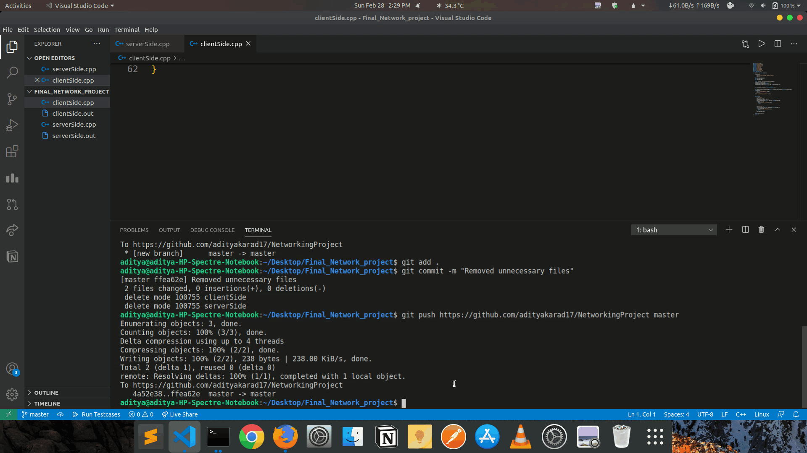

# Client Server Communication with Multiple Clients

- This project consists for a TCP protocol based bidirectional multi-client server communication. Clients can send the server messages and the server can respond as well.

## How to Use?

- Download the entire project, open up your terminal in Linux, and navigate to this folder.
- Enter `./serverSide.out 3000` , where 3000 is the PORT number
- Enter `./clientSide.out [localhost](http://localhost) 3000` where 3000 is the same PORT number as provided for server.
- Client has to send the first message, then server and so on. For quitting the chat, either the server or client can enter `exit` and the program will terminate.
- For testing multiple client, open up a new window and enter `./clientSide.out [localhost](http://localhost) 3000`. When you want to quit, enter `exit` and server can go back to the previous client.

## Tech Stack Used

- C++ language, and it's inbuilt libraries for socket programming
- TCP protocol.

## Logic Used

- TCP protocol
- Socket programming.

## Results obtained
- Bidirectional multi-client server communication.
- Either can send full length texts with low latency.

## Existing Features

1. Sending single word strings with single client.

## New Features

1. Multi-client bidirectional communication is possible. That is, server can communicate with a second client and when that terminates, it can go back to communicating with the previous client. This is possible by `fork()` function.
2. User can send full lines of text i.e. words with spaces in them.
3. Better error handling added for `listen()` and `accept()` .
4. Labels added for more intuitive messaging.

## Future Goals

- Adding color to error messages, for better use.
- Asking for name of the user before connection so that the server can know more information of client, and also for better messaging experience.

## Working Demo
- GIF clearly demonstrates that the server is able to communicate with 2 clients. After the second client terminates the chat, the server goes back to communicate with the first client.

